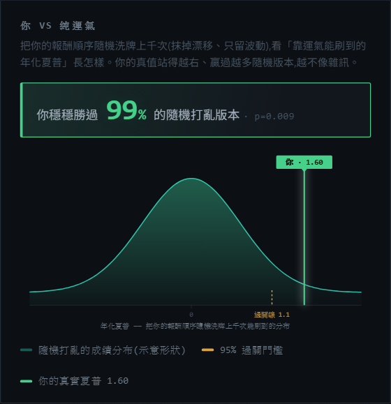
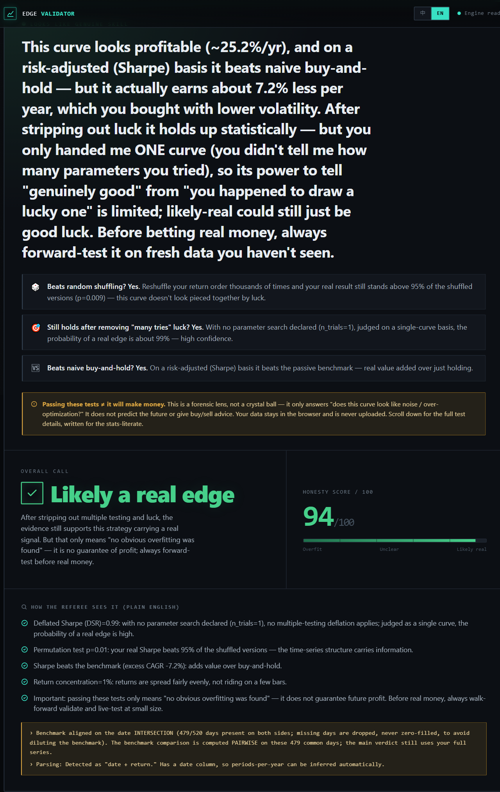
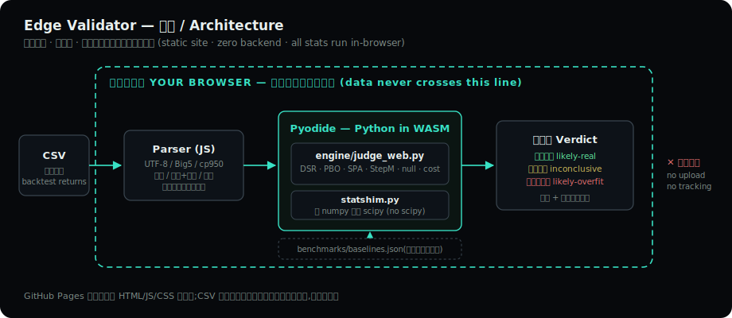

# Edge Validator — 策略照妖鏡

[](https://github.com/hades60414-sys/edge-validator/actions/workflows/engine-tests.yml)

**把你的回測丟進來,它假設你是錯的,然後用學界標準的統計檢定試著反駁你。**
過得了關的,才可能是真 edge;過不了的,恭喜你在賠真錢之前就知道了。

### 👉 [**線上 Live Demo — hades60414-sys.github.io/edge-validator**](https://hades60414-sys.github.io/edge-validator/) 👈

零安裝、零註冊、資料不上傳——打開就能玩(內建兩份示範資料:一份真 edge、一份過擬合)。


---

## 為什麼做這個

這套裁判制度不是憑空發明的。它萃取自一座量化策略農場的殘酷經驗:**4,800+ 次策略試驗、0 個通過誠實的樣本外驗證**(這個數字怎麼記帳、判死流程長怎樣、以及它本身的證據力上限——完整佐證見 [試驗墓地文件](docs/trial-graveyard.md))。農場的結論是——免費資料+散戶資本下,可部署的 alpha 幾乎不存在;回測裡那些漂亮的曲線,絕大多數是把雜訊擬合成了形狀。

但那套「不放水的裁判」本身有價值。與其再蓋一個幫你「找到看起來會賺的策略」的回測平台,不如把裁判獨立出來,**在你把錢放進一個過擬合的回測之前攔下你**。這就是這個產品的全部。

## 它長什麼樣

上傳逐期報酬(或淨值曲線),按下「照妖」,得到一份**白話判決書**——先給不懂統計的人一句話結論,再給懂統計的人完整檢定證據:


其中「你 vs 純運氣」這張圖,把你的報酬順序隨機洗牌上千次,看你贏得過幾 % 的隨機版本:



介面完整支援中英雙語(判決主文、最多七道閘、方法論全部雙語化):



## 架構:整台統計引擎跑在你的瀏覽器裡



這個站沒有後端。不是「後端很小」,是**沒有**——GitHub Pages 只送靜態檔,你的 CSV 從進到出都不離開瀏覽器。做到這件事有幾個實際要解的難題:

### 1. Python 統計引擎 → 瀏覽器內執行(Pyodide / WebAssembly)

裁判引擎(`engine/judge_web.py`,約 1,600 行)是純 Python + numpy/pandas,透過 [Pyodide](https://pyodide.org) 編譯成 WASM 在瀏覽器內跑。同一份引擎程式碼在 CPython 下直接 `pytest`(123 個測試,其中一支專門對帳本 README 的數字宣稱、漂移即紅),前端只是把它注入 Pyodide——**測試環境與生產環境是同一份程式碼**,不存在「JS 重寫一遍然後兩邊算不一樣」的問題。

### 2. 沒有 scipy 怎麼辦:純 numpy 的 `statshim`

DSR 需要常態分布的 CDF/PPF、偏度、峰度——通常這是 `scipy.stats` 的活,但 scipy 在 Pyodide 裡是幾十 MB 的負擔。解法是 `engine/statshim.py`:用 stdlib 的 `math.erf` 實作 `norm_cdf`,用 Acklam 有理逼近 + Halley 修正實作 `norm_ppf`(對照 scipy 誤差 < 1e-9),偏度/峰度手算動差、對齊 scipy 的預設行為。129 行換掉整個 scipy 依賴。

### 3. 雜訊硬化 + fail-closed:裁判不能被「幸運的雜訊」騙過

對抗審查時發現:高欄數 × 短樣本下,純雜訊矩陣偶爾也能抽到一條撐過 DSR 的曲線。修法是讓 DSR 的試驗數懲罰沿倍率序列遞增,直到把雜訊壓回地板;若放大到封頂(32×)**仍然**壓不下去,引擎不會聳肩放行,而是標記 `capped_escape` 並強制**不判 likely-real**——無法排除過擬合時,寧可 fail-closed。這是整個產品的裁判哲學:**有疑慮就不放行**。

同一哲學貫穿所有輸入通道:**別人填 0,我拒審**——空白格/NaN 絕不填 0(填 0 會壓低波動、抬高夏普),缺格率 ≥5% 直接拒絕評審;重複的日期時戳絕不靜默去重(複製「好日子」灌水在舊路徑能把年虧策略洗成 86 分,現在 ≥5% 重複一律拒審);基準缺值絕不填 0 稀釋(那會讓「贏過基準」變太容易);換手率缺值絕不填 0(那會低估成本)。每個「輸入通道 × 異常型態」的政策與對應測試,逐格列在 [docs/INTEGRITY_MATRIX.md](docs/INTEGRITY_MATRIX.md)——沒有測試釘住的格子,就誠實標「未防禦」與理由。

### 4. 中英雙語 i18n

全站字串(含判決主文的動態模板)走 `data-i18n` 屬性 + 字典切換,語言偏好存 localStorage、首繪前就設好 `<html lang>`。中文為主(觀眾是台灣金融圈),英文完整可用。

### 5. 體感工程

Pyodide 首次載入要下載約 10–15MB 的數值套件——載入條做了分段進度(啟動 Python → 載入 NumPy/Pandas → 注入引擎 → 自我測試),之後瀏覽器快取。CSV 解析支援 UTF-8 / Big5 / cp950(台灣券商匯出檔的現實)、百分比與千分位符號(含 RFC4180 引號包裹的 `"1,234.56"`,Excel/券商標準輸出;不支援引號內換行)、淨值曲線自動轉報酬。

## 最多七道閘(依你給的資料形態啟用)

不是每次都七道全跑——這裡誠實講清楚:**單一報酬曲線**必跑的是 DSR 與隨機重排;PBO/SPA/StepM 需要**多策略矩陣**才有東西可檢;成本壓力需要換手率、基準比較需要你選一條基準。未啟用的閘在判決卡上會標「略過」,**略過不算通過**。

| # | 閘 | 啟用條件 | 擋什麼騙局 |
|---|-----|---------|-----------|
| 1 | **DSR** 通縮夏普(Bailey & López de Prado) | 所有模式 | 扣掉「你試了幾種參數才挑到這條曲線」的運氣成分 |
| 2 | **PBO / CSCV** 回測過擬合機率 | 僅矩陣模式(≥2 欄) | 樣本內最優,樣本外墊底的機率 |
| 3 | **Hansen SPA** 優越性檢定 | 僅矩陣模式 | 資料挖掘後,真的贏過基準嗎 |
| 4 | **Romano–Wolf StepM** | 僅矩陣模式 | 多重比較家族誤差修正後的倖存篩選 |
| 5 | **成本壓力測試** | 需提供換手率 | 手續費/滑價 ×1/×3/×6 後,夏普還正嗎 |
| 6 | **隨機重排 null** | 所有模式 | 打亂報酬順序上千次,你贏得過隨機嗎 |
| 7 | **對照基準** | 需選一條基準 | vs 0050 買進持有等被動基準,你有加值嗎 |

綜合判決三態:**可能真實 / 結論不明 / 疑似過擬合**。過關 ≠ 會賺——它只代表「沒發現明顯的過擬合/挖掘偏誤」。

校準揭露(誠實聲明):SPA / Romano–Wolf 這兩道 FWER 閘經蒙地卡羅校準與獨立複驗——iid 與中度自相關(AR(1)=0.30)、T=250/500 情境下,家族偽陽率均落在名目水準內;但**強自相關資料下 block bootstrap 的有限樣本殘餘偽陽可能略高(獨立校準顯示 +1pp 以內,在蒙地卡羅誤差範圍)**,讀 SPA/RW 結果時請把這一點放在心上。

### 誠實分數怎麼算

判決卡上的「誠實分數 /100」不是黑箱:規則全在 `engine/judge_web.py` 的 `_verdict()`,而且判決輸出裡直接附上機器可讀的逐項加減分明細(`score_breakdown`,首項 base=50、之後每筆 `{code, delta}`,總和夾 0–100 後即為分數,測試釘死此不變式)。規則摘要:

- **從 50 分起算**,每道有跑的閘依結果加減分(未啟用的閘不加不減):
  DSR ≥0.95 加 18、過雜訊地板(0.60)加 6、低於地板**扣 22 並直接觸發過擬合旗標**;PBO ≤0.50 加 10、>0.50 扣 20(觸發旗標);隨機重排勝過 p95 加 14、沒過 p95 但 p≤0.50 小扣 4、p>0.50 扣 18(觸發旗標);成本 ×3 後夏普正加 8、負扣 12;贏基準加 8、輸扣 8;報酬集中度低加 4、單期貢獻 ≥40% 扣 12。
- **另有誠實懲罰**:試驗數 >20 依 log 扣分(至多 15)、樣本 <60 期扣 8、雜訊硬化封頂逃逸(capped-escape)扣 14 並強制不判「可能真實」。
- 分數夾在 0–100。**三態判定不只看分數**:任何一道旗標型閘失敗 → 疑似過擬合;所有實跑的閘都沒失敗**且**分數 ≥62 → 可能真實;其餘 → 結論不明。
- 已知限制(誠實揭露):單一報酬序列沒有「真試驗池」可量測離散度,此時 DSR 改用 **SR 估計標準誤 SE(SR)=√((1+SR²/2)/n) 作為試驗離散度的保守下限**做真通縮——判決文案會照實標明這是保守 proxy 而非真試驗池,不假稱有。

## 隱私與誠實聲明

- **你的資料不離開瀏覽器。** 所有計算在你本機的 Pyodide 內跑,CSV 不上傳任何伺服器、無任何追蹤。關掉分頁,一切歸零。
- **這不是投資建議。** 它是統計工具,不推薦任何策略、不叫你買賣。
- **統計通過是必要非充分條件。** 真金白銀前,請務必做前向(walk-forward)驗證與小額實測。

## 技術棧

| 層 | 選擇 |
|----|------|
| 前端 | Vanilla JS + 手寫 CSS(無框架、無 build step,`app.js` 約 2,600 行) |
| 統計引擎 | Python(numpy / pandas)+ 自製 `statshim`(取代 scipy) |
| 執行環境 | Pyodide 0.26(Python-in-WASM,瀏覽器內) |
| 測試 | pytest(引擎測試,CPython 下直接跑同一份引擎碼)+ GitHub Actions CI(push/PR 跑快層,對抗網格掃描每週排程跑) |
| 部署 | GitHub Pages,純靜態、零後端 |

```
index.html / app.js / style.css   ← 前端(解析、i18n、圖表、判決渲染)
engine/judge_web.py               ← 統一裁判引擎(唯一入口 analyze(payload) → verdict)
engine/statshim.py                ← 純 numpy 的 scipy 替身
engine/test_engine.py             ← 引擎測試
benchmarks/baselines.json         ← 對照基準(隨站台靜態載入)
docs/                             ← 截圖、架構圖、試驗墓地佐證
.github/workflows/                ← CI(engine pytest:push/PR 快層 + 每週完整層)
```

---

## English (TL;DR)

**Edge Validator** is a client-side forensic lens for backtests: upload your strategy's per-period returns and it assumes you are wrong, then tries to refute you with academically standard tests — up to seven gates, enabled by what your data supports: Deflated Sharpe Ratio and permutation nulls always run; PBO/CSCV, Hansen's SPA and Romano–Wolf StepM require a multi-strategy matrix; cost stress (×1/×3/×6) requires turnover; benchmark comparison requires picking a benchmark. Skipped gates are shown as skipped — a skip never counts as a pass.

**Try it live: [hades60414-sys.github.io/edge-validator](https://hades60414-sys.github.io/edge-validator/)** — no install, no signup, no upload.

Architecture highlights:

- **Zero backend.** The full Python/numpy referee engine runs *inside your browser* via Pyodide (WASM). Your CSV never leaves your machine.
- **Same code in test and prod.** The engine is plain Python, unit-tested under CPython with pytest, and injected verbatim into Pyodide — no JS reimplementation drift.
- **No scipy needed.** A 129-line pure-numpy `statshim` replaces scipy.stats (norm CDF via `math.erf`, PPF via Acklam's approximation + Halley refinement, |err| < 1e-9).
- **Fail-closed by design.** When escalated noise-hardening still can't rule out overfitting (capped-escape), the referee refuses to call "likely real." Missing cells are never zero-filled and duplicate timestamps are never silently deduped — at ≥5% either way, it refuses to judge (others fill zeros; this one refuses). The full input-channel × anomaly policy table lives in [docs/INTEGRITY_MATRIX.md](docs/INTEGRITY_MATRIX.md). When in doubt, it does not pass you.
- **Born from 4,800+ strategy trials with 0 honest out-of-sample survivors.** This tool is the referee system distilled from that farm — built to stop you before you fund an overfit backtest. How that number is accounted for, the kill pipeline, and the honest limits of the claim itself: see the [trial graveyard](docs/trial-graveyard.md) (English summary at the bottom).

*Not investment advice. Passing the gates is necessary, not sufficient — always walk-forward test before real money.*
